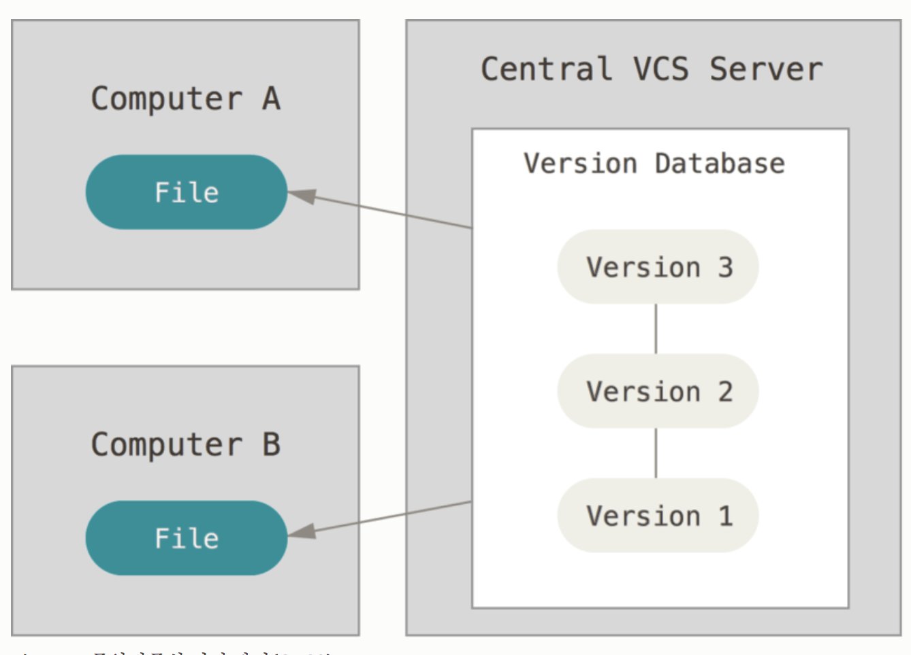
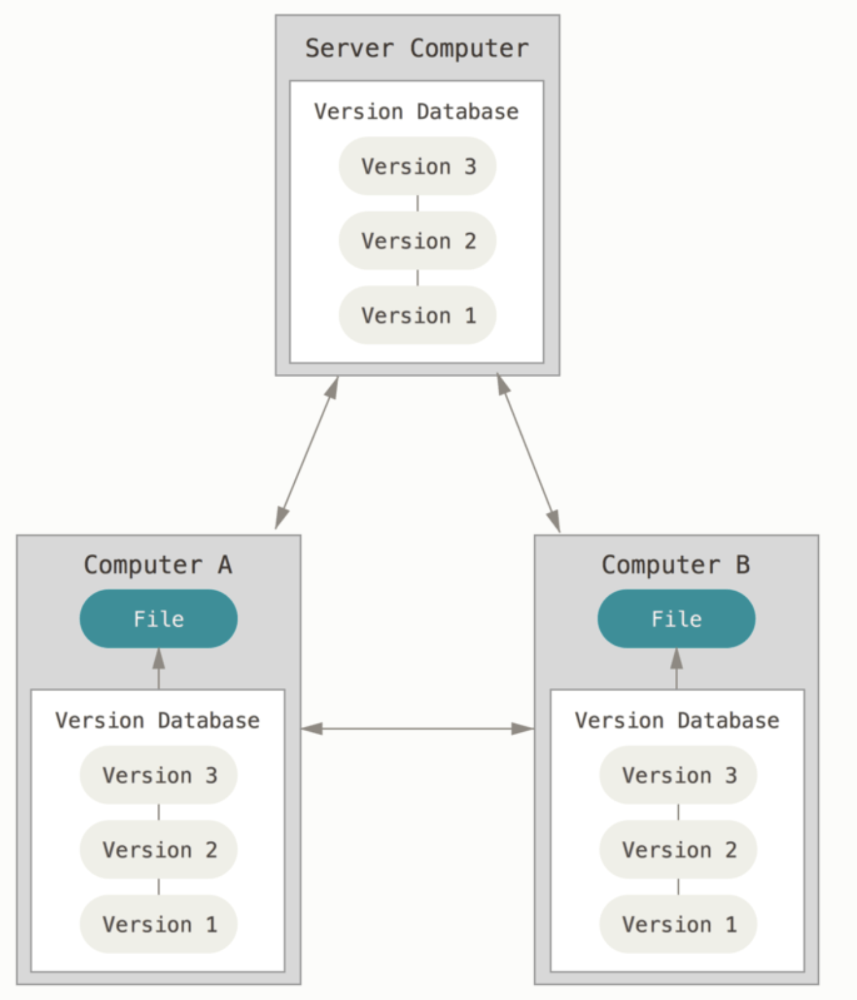
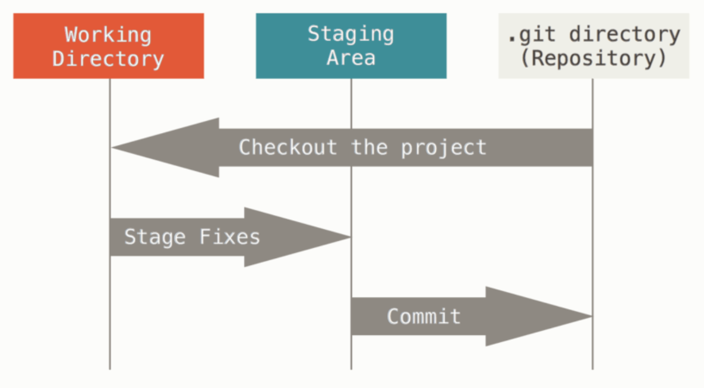
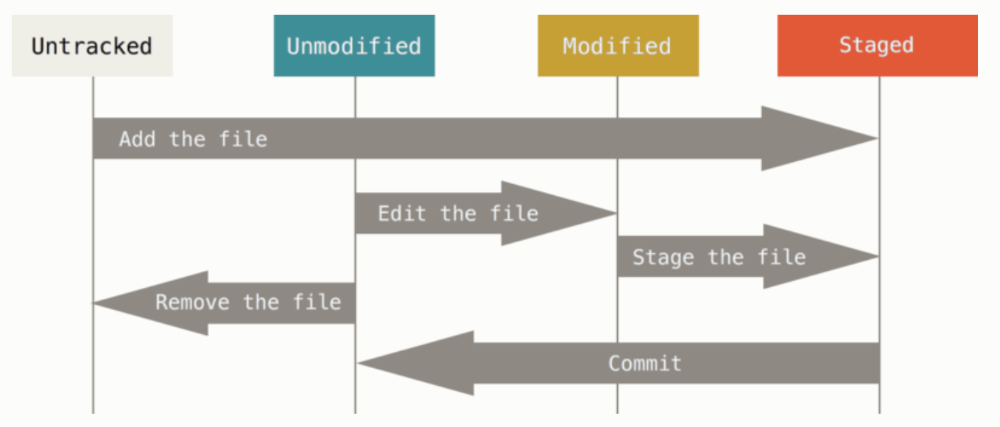
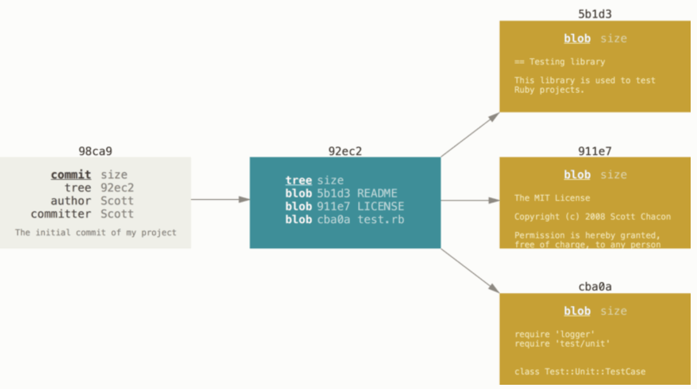

# git 정리

## 목차
- [git 기초](#git-기초)
    - [버전 관리란?](#버전-관리란)
    - [버전 관리 시스템을 왜 사용할까?](#버전-관리-시스템을-왜-사용할까)
    - [로컬 VCS](#로컬-vcs)

1. ## git 기초
    * ### 버전 관리란?
        * 파일 변화를 시간에 따라 기록했다가 나중에 특정 시점의 버전을 다시 꺼내올 수 있는 시스템.
        [목차](#목차)
    * ### 버전 관리 시스템을 왜 사용할까?
        1. 현재 개발중인 버전과 릴리즈 된 버전을 분리할 수 있다. 같은 소스의 여러 revision을 관리할 수 있다. revision을 관리한다는 말은 현재 작업한 버전과 어제 완료하여 출시한 버전으로 따로 구분할 수 있다는 말이다.
        1. History 관리 기능이 강력하다. 공동 작업 시 누가 어느 부분을 수정했는지 알기 힘든데 vcs는 소스의 추가, 수정, 삭제 등을 모두 추적할 수 있고, 잘못된 부분이 있어도 그 이전으로 손쉽게 돌아갈 수 있다.
        1. 중앙 집중적 소스관리이다. 이는 다른 사람들이 개인의 컴퓨터에서 코드를 손실할 시 모든 것을 처음부터 해야할 수도 있는데 반해 하나의 중앙 시스템이 관리함으로써 소스코드를 안전하게 보관할 수 있다.(중앙 시스템이 먹통이 되는 경우라면...?)
    * ### 로컬 VCS
        * 간단한 데이터 베이스를 사용해서 파일의 변경 정보를 관리
        * RCS(Revision Control System)
    * ### CVCS
        * CVS, Subversion, Perforce 같은 시스템은 파일을 관리하는 서버가 별도로 있고 클라이언트가 중앙 서버에서 파일을 받아서 사용함.
        * 중앙 서버에서 문제가 발생한다면 해결하는 동안 아무도 다른 사람과 협업 할 수 없다. 또 중앙 데이터베이스의 하드디스크에 문제가 생기면 그 동안의 히스토리를 모두 잃을 수 있다.
 (이미지 출처: https://git-scm.com/book/ko/v2/%EC%8B%9C%EC%9E%91%ED%95%98%EA%B8%B0-%EB%B2%84%EC%A0%84-%EA%B4%80%EB%A6%AC%EB%9E%80%3F)
    
    * ### 형상관리 툴 비교
        * https://en.wikipedia.org/wiki/Comparison_of_version_control_software
        * http://imover.tistory.com/9 
    * ### DVCS(분산 버전 관리 시스템)
        * Git, Mercurial, Bazaar, Darcs같은 시스템. 단순히 파일의 마지막 스냅샷을 checkout하는 것이 아니라 저장소를 전부 복제한다.
        * 서버에 문제가 생기면 저장소를 복제하므로 다시 작업을 시작할 수 있다.
        * 대부분의 DVCS 환경에서는 리모트 저장소가 존재한다. 리모트 저장소가 많을 수도 있다. 이를 통해 다양한 그룹과 다양한 방법으로 협업을 진행할 수 있다.
 (이미지 출처: https://git-scm.com/book/ko/v2/%EC%8B%9C%EC%9E%91%ED%95%98%EA%B8%B0-%EB%B2%84%EC%A0%84-%EA%B4%80%EB%A6%AC%EB%9E%80%3F)

    * ### git의 목표
        * 빠른 속도
        * 단순한 구조
        * 비선형적인 개발(수천 개의 동시 다발적인 브랜치)
        * 완벽한 분산
        * Linux 커널 같은 대형 프로젝트에도 유용할 것(속도나 데이터 크기 면에서)
    * ### git의 기초
        * svn과 같은 형상 관리 툴과 git의 차이는 데이터를 다루는 방법에 있다.
        * svn과 같은 툴은 파일의 변화를 시간순으로 관리하며 파일들의 집합을 관리한다.
        * git은 데이터를 파일 시스템 스냅샷으로 취급하고 크기가 아주 작다. 데이터를 스냅샷의 스트림처럼 취급한다.
        * 거의 모든 명령을 로컬에서 실행한다. 이는 네트워크에 접속하는 것이 아니기에 속도가 빠르다.
        * git은 프로젝트의 히스토리를 조회할 때 서버 없이 조회. 로컬 데이터베이스의 히스토리를 읽어서 보여준다.
        * git의 무결성: git은 데이터를 저장하기 전에 항상 체크섬을 구하고 그 체크섬으로 데이터를 관리한다.
        이러한 체크섬을 이해하는 git 없이는 어떠한 파일이나 디렉토리도 변경할 수 없다.
        * **체크섬**: git에서 사용하는 가장 기본적인 데이터 단위이자 기본 철학. 깃은 sha-1해시를 사용하여 체크섬을 만든다. 40자 길이의 16진수 문자열. 파일의 내용이나 디렉토리 구조를 이용하여 체크섬을 구한다. git은 파일의 이름으로 저장하는 것이 아닌 해당 파일의 해시로 저장한다.
    * ### Snapshot이란?
        * 기술적인 용어로, 특정 시간에 저장 장치의 상태를 나타냄
    * ### 세 가지 상태
        1. Committed: 데이터가 로컬 데이터베이스에 안전하게 저장됐다는 것을 의미한다. git 디렉토리에 있는 상태.
        1. Modified: 수정한 파일을 아직 커밋하지 않은 것. Checkout 후 수정까지 했지만 staging area에 추가하지 않은 상태.
        1. Staged: 현재 수정한 파일을 곧 커밋할 것이라고 표시한 상태. Stageing area에 들어가 있는 상태
 (이미지 출처: https://git-scm.com/book/ko/v2/%EC%8B%9C%EC%9E%91%ED%95%98%EA%B8%B0-Git-%EA%B8%B0%EC%B4%88)

    * ### Git 디렉토리
        * git이 프로젝트의 메타데이터와 객체 데이터베이스를 저장하는 곳을 말한다.
        * git의 핵심
    * ### 워킹 트리
        * 프로젝트의 특정 버전을 checkout한 것이다. git 디렉토리는 지금 작업하는 디스크에 있고 그 디렉토리 안에 압축된 데이터베이스에서 파일을 가져와서 워킹 트리를 만든다.
    * ### Staging area
        * git 디렉토리에 있다. 단순한 파일이고 곧 커밋할 파일에 대한 정보를 저장한다. 종종 index라고 불리기도 한다.
    * ### git으로 하는 일
        1. 워킹트리에서 파일을 수정한다.
        1. Staging area에 파일을 stage해서 커밋할 스냅샷을 만든다.
        1. Staging area에 있는 파일들을 커밋해서 git 디렉토리에 영구적인 스냅샷으로 저장.

1. ## git 사용법
    * ### git 저장소 만들기
        * git init: .git이라는 하위 디렉토리를 만든다. .git 디렉토리에는 저장소에 필요한 뼈대 파일이 들어 있다. 파일 관리를 위해서는 저장소에 파일을 추가하고 커밋해야 한다. git add 명령으로 파일을 추가하고 git commit 명령으로 커밋한다.
    * ### 기존 저장소를 clone하기
        * git clone [url]: 서버에 있는 거의 모든 데이터를 복사해온다.
    * ### 수정하고 저장소에 저장하기
        * tracked(관리 대상)와 untracked(관리 대상이 아님)으로 나뉨. Tracked 파일은 이미 스냅샷에 포함되어 있던 파일이다. Tracked 팡리은 또 unmodified, modified, staged로 나뉜다. 이 외에는 모두 untracked 파일이다.
 (이미지 출처:https://git-scm.com/book/ko/v2/Git%EC%9D%98-%EA%B8%B0%EC%B4%88-%EC%88%98%EC%A0%95%ED%95%98%EA%B3%A0-%EC%A0%80%EC%9E%A5%EC%86%8C%EC%97%90-%EC%A0%80%EC%9E%A5%ED%95%98%EA%B8%B0)
    * ### 새로 추적하기 (git add)
        * 새로 추적할 파일을 등록하는데도 필요하지만 변경된 파일을 staged 상태로 만들 때도 필요하다. merge시 충돌한 상태의 파일을 resolve 상태로 만들때도 사용한다.
        * git add 명령을 실행한 후에 파일을 변경하면 또 git add 명령으로 staged 상태로 만들어 주어야 한다.
        * git status -s 옵션: 현재 깃의 상태를 간략하게 보여주는 옵션. 두 개의 문자로 상태를 표시해준다. 왼쪽의 글자는 staged상태일 때 새로 파일을 추가했으면 A, 변경된 파일이라면 M으로 표시한다. 두 번째 글자가 M이라면 이미 staged된 상태에서 파일을 추가적으로 변경했을시 표시됨. 아직 추적하지 않은 파일에 대해서는 ?? 로 표시한다.
    * ### git이 관리할 필요가 없는 파일
        * git이 관리할 필요가 없는 파일은 .gitignore 파일을 만들고 그 안에 무시할 파일 패턴을 적는다. [.o .a]로 끝나는 파일들은 각각 빌드 시스템이 만들어내는 오브젝트와 아카이브 파일이고 ~로 끝나는 파일은 emacs나 vi 같은 텍스트 편집기가 임시로 만들어내는 파일이다. 또 log, tmp, pid같은 디렉토리나 자동으로 생성하는 문서 같은 것들도 추가할 수 있다.
        * .gitignore 파일에 입력하는 패턴
            * 아무것도 없는 라인이나, '#'으로 시작하는 라인은 무시한다.
            * 표준 glob 패턴을 사용.
            * 슬래시(/)로 시작하면 하위 디렉토리에 적용되지 않는다.
            * 디렉토리는 슬래시 끝에 사용하는 것으로 표현한다.
            * 느낌표로 시작하는 패턴의 파일은 무시하지 않는다.
        * glob pattern: 정규표현식을 단순하게 만든 것으로 생각하면 된다. 보통 쉘에서 많이 사용. 애스터리스크(*)는 문자가 하나도 없거나 하나 이상을 의미, [abc]는 괄호 안에 있는 문자 중 하나를 의미, 물음표(?)는 문자 하나를 말하고 [0-9]의 하이픈은 그 캐릭터 사이에 있는 하나를 말한다. 애스터리스크 2개를 사용해서 디렉토리 안의 디렉토리까지 지정할 수 있다. a/**/z -> a/z, a/b/z, a/b/c/z
    * ### git diff
        * 단순히 파일이 변경됐다는 사실이 아니라 어떤 내용이 변경됐는지 살펴보기 위해 git diff를 사용한다. 어떤 라인을 추가했고 어떤 라인을 삭제했는지 궁금할 때 사용한다. staged된 파일의 변경사항을 보기 위해서는 git diff [--staged | --cached]를 사용하면 된다.
    * ### git commit
        * staging area에 들어가 있어야만 commit이 반영된다. staging area를 생략하기 위해서 -a 옵션을 사용하면 된다. 이는 tracked된 파일을 자동으로 staging area에 넣어줌으로써 git add 명령을 실행하는 수고를 덜 수 있다.
    * ### git 파일 삭제하기
        * git rm 명령어를 사용하면 해당 파일을 staging area에서 삭제할 수 있다. 단, 이 명령은 워킹 디렉토리에 있는 파일도 삭제하기 때문에 실제로 파일도 지워진다.터미널에도 rm 명령어가 있는데 이 명령어를 사용하면 commit할 내용이 없어지지만 git rm 을 사용하면 git에도 관련 정보가 남는다. 이 때 git rm 명령어를 실행한 후 커밋을 했다면 git은 더 이상 이 파일을 추적하지 않는다. 만약 이미 파일을 수정했거나 index(stagin area를 git index라고도 함)에 추가했다면 -f 옵션을 주어 강제로 삭제해야 한다.이 점은 실수로 데이터를 삭제하지 못하도록 하는 안정장치다. 커밋하지 않고 수정한 데이터는 git으로 북구할 수 없다.
        * staging area에서만 제거하고 워킹 디렉토리에 있는 파일은 지우지 않으려면 git rm --cached 옵션을 추가하면 된다.
        * rm 명령어는 file-glob패턴을 사용하기에 여러 개의 파일이나 디렉토리를 한꺼번에 삭제할 수도 있따. ex) git rm log ^*.log
    * ### 파일 이름 변경하기
        * git mv file_from file_to를 이용하여 파일 이름을 변경할 수 있다.   git mv는 일종의 단축 명령어다. 
        git mv README.md README 는 다음과 같다.  
        mv README.md README  
        git rm README.md  
        git add README  
    * ### 커밋 히스토리 조회하기
        * git log라는 명령어가 있다. 아무런 argument없이 실행하면 저장소의 커밋 히스토리를 시간순으로 보여준다. 가장 최근의 커밋이 먼저 나온다. 이어서 각 SHA-1 체크섬, 저자 이름, 저자 이메일, 커밋한 날짜, 커밋 메시지를 보여준다.
            * -p 옵션: 이는 각 커밋의 diff 결과를 보여준다.
            * -[n] 옵션: n 개의 커밋 결과를 보여준다.
            * --stat 옵션: 어떤 파일이 수정됐는지, 얼마나 많은 파일이 변경됐는지, 또 얼마나 많은 라인을 추가하거나 삭제했는지 보여준다.
            * --pretty 옵션: 히스토리 내용을 보여줄 때 기본 형식 이외에 여러가지 중에 하나를 선택할 수 있다. oneline은 각 커밋을 한 라인으로 보여준다. 많은 커밋을 볼 때 유용하다. short, full,
            fuller 등의 옵션도 있는데 이것은 정보를 조금씩 가감해서 보여준다. format 옵션은 나만의 포맷으로 결과를 출력하고 싶을 때 사용한다. 특히 결과를 다른 프로그램으로 파싱하고자 할 때 유용하다. 이 옵션을 사용하면 포맷을 정확하게 일치시킬 수 있기 때문에 git을 새 버전으로 바꿔도 결과 포맷이 바뀌지 않는다.  
                * 이 때 저자는 원래 작업을 수행한 원작자이고 커미터는 마지막으로 이 작업을 적용한 사람이다.
            * --graph 옵션: 이 옵션과 같이 명령을 사용하면 브랜치와 머지 히스토리를 보여주는 ㅇ라스키 그래프를 출력한다.
            * --shortstat: stat 명령의 결과 중에서 수정한 파일, 추가된 라인, 삭제된 라인만 보여준다.
            * --name-onlhy:  커밋 정보중에서 수정된 파일의 목록만 보여준다.
            * --name-status: 수정된 파일의 목록을 보여줄뿐만 아니라 파일을 추가한 것인지, 수정한 것인지, 삭제한 것인지도 보여준다.
            * --abbrev-commit: 40자 짜리 SHA-1 체크섬을 전부 보여주는 것이 아니라 처음 몇 자만 보여준다.
            * --relative-date: 정확한 시간을 보여주는 것이 아니라 현재 시각에 대해 상대적인 시각을 보여준다.
            * 조회 제한 조건
                * --since나 --until과 같이 시간을 기준으로 조회하는 옵션은 매우 유용하다. 예시) git log --since=2.weeks
                * --author 옵션: 저자를 지정하여 검색할 수 있다.
                * --grep 옵션: 커밋 메세지에서 키워드를 검색할 수 있다.
                * --all-match 옵션: author와 grep을 모두 만족하는 커밋을 찾기 위해서는 반드시 사용해야 한다.
                * -S 옵션: 코드에서 추가되거나 제거된 내용 중에 특정 텍스트가 포함되어 있는지를 검색한다.  예시) git log --Sfunction_name
                * 파일경로로 검색하는 옵션도 있다. --와 함께 경로 이름을 사용하는데 명령어 끝 부분에 쓴다.
    * ### 되돌리기
        * git에서는 한 번 되돌리면 복구 할 수 없으므로 조심히 사용해야 한다.
        * git commit --amend 옵션: 완료한 커밋을 수정하기 위해 사용한다. 이 명령은 staging area를 사용하여 커밋한다. 만약 마지막으로 커밋하고 나서 수정한 것이 없다면 조금 전에 한 커밋과 모든 것이 같게 된다. 이 때는 커밋 메시지만 수정한다.
        * git reset HEAD \<file\>: 이 명령으로 unstaged상태로 변경할 수 있다. 하지만 git reset명령은 매우 위험하므로 조심히 사용해야 한다. 특히, --hard옵션과 사용할때는 더더욱!
        * git checkout -- \<file\>: 파일을 수정하고 나서 최근의 커밋 상태로 되돌리기 위해 사용하는 명령어. 이 명령 역시 조심해서 사용해야 한다. 수정하기 전의 원래 파일로 덮어쓰는 것이므로 수정한 내용은 전부 사라진다.
    * ### 리모트 저장소
        * 리모트 저장소를 관리할 줄 알아야 다른 사람과 함께 일할 수 있다. 리모트 저장소는 인터넷이나 네트워크 어딘가에 있는 저장소를 말한다. 저장소에 따라 읽고 쓰기가 모두 가능한 저장소가 있고 읽기만 가능한 저장소 등으로 나뉠 수 있다.
        * 리모트 저장소 확인하기
            * git remote  명령어를 통해 현재 프로젝트에 등록된 리모트 저장소를 확인할 수 있다. 이 명령은 리모트 저장소의 단축 이름을 보여준다.
            * -v 옵션을 사용하여 단축 이름과 URL을 함께 볼 수 있다.
        * 리모트 저장소 추가하기
            * git remote add [단축 이름] [url]
        * pull과 fetch
            * 리모트 저장소에서 데이터를 가져오기 위해서 git fetch [remote-name] 명령어 사용. 이 명령어는 로컬에는 없지만 리모트에는 있는 데이터를 모두 가져온다. clone 한 후 또는 마지막으로 가져온 이후에 수정된 것을 모두 가져온다. 하지만 자동으로 merge하는 것은 아니다.
            * git pull 명령으로 fetch와 merge를 동시에 진행할 수 있다.
        * push
            * 프로젝트를 공유하고 싶을 때 upstream 저장소에 push할 수 있다.
            * git push [리모트 저장소 이름] [브랜치 이름]
            * 이 때 이 명령어는 리모트 저장소에 쓰기 권한이 있고, 클론 한 이후 아무도 upstream 저장소에 push 하지 않았을 때만 사용할 수 있다.
        * 리모트 저장소 살펴보기
            * git remote show [리모트 저장소 이름] 명령으로 리모트 저장소의 구체적인 정보를 확인할 수 있다.
        * 리모트 저장소 이름을 바꾸거나 리모트 저장소 삭제하기
            * git remote rename [이전 이름] [바꿀 이름]
            * git remote (remove || rm) [리모트 이름]
            * 더는 별도의 미러가 필요하지 않을 때, 더는 기여자가 활동하지 않을 때 사용한다.
    * ### tag(태그)
        * tag를 사람들은 보통 릴리즈할 때 사용한다.
        * 태그 조회하기
            * git tag 명령으로 이미 만들어진 태그가 있는지 확인할 수 있다. 이 명령은 알파벳 순서대로 태그를 보여준다. 검색 패턴을 사용하여 태그를 검색할 수 있다.  
            git tag -l [검색할 내용]
        * 태그 붙이기
            * Lightweight 태그: 브랜치와 비슷하지만 브랜치처럼 가리키는 지점을 최신 커밋으로 이동시키지 않는다. 단순히 특정 커밋에 대한 포인터일 뿐이다. 기본적으로 파일에 커밋 체크섬을 저장하는 것뿐이다. 다른 정보는 저장하지 않는다. Lightweight 태그를 만들 때는 -a, -s, -m 옵션을 사용하지 않는다. git show명령어를 사용하면 단순히 커밋 정보만을 보여준다.
            * Annotated 태그: git 데이터베이스에 태그를 만든 사람의 이름, 이메일과 태그를 만든 날짜, 그리고 태그 메시지도 저장한다. GPG(GNU Privacy Guard)로 서명할 수도 있다. 일반적으로 annotated 태그를 만들어 이모든 정보를 사용할 수 있도록 하는 것이 좋다. 하지만 임시로 생성하는 태그거나 이러한 정보를 유지할 필요가 없는 경우에는 lightweight 태그를 사용할 수도 있다. git show 명령으로 태그 정보와 커밋 정보를 모두 확인할 수 있다. 커밋 정보를 보여주기 전에 먼저 태그를 만든 사람이 누구인지, 언제 태그를 만들었는지, 그리고 태그 메시지가 무엇인지 보여준다.  
            git tag -a v1.4 -m [메세지 내용]
        * 나중에 태그하기
            * 예전 커밋에 대해서도 태그할 수 있다. 이 때 특정 커밋에 태그하기 위해서 명령의 끝에 커밋 체크섬을 명시하면 된다.(체크섬을 전부 사용할 필요는 없다.)  
            git tag -a v1.2 [체크섬]
        * 태그 공유하기
            * git push 명령은 자동으로 리모트 서버에 태그를 전송하지 않는다. 태그를 만들었으면 서버에 별도로 push해야 한다.  
            git push origin [태그 이름 || --tags]  
            만약 한 번에 태그를 여러 개 push 하고 싶으면 --tags 옵션을 추가하여 git push 명령을 실행한다. 이 명령으로 리모트 서버에 없는 태그를 모두 전송할 수 있다.
        * 태그를 checkout 하기
            * 태그는 브랜치와는 달리 가리키는 커밋을 바꿀 수 없는 이름이기 때문에 checkout 해서 사용할 수 없다. 태그가 가리키는 특정 커밋 기반의 브랜치를 만들어 작업하려면 새로 브랜치를 생성해야한다.  
            git checkout -b [브랜치명] [태그명]
    * ### git alias
        * git의 명령을 전부 입력하는 것이 귀찮다면 git config를 사용하여 각 명령의 alias를 만들 수 있다.  
        git config --global alias.[alias명] [명령]  
        외부 명령어도 실핼할 수 있다. !를 제일 앞에 추가하면 외부 명령을 실행한다.  
        gitk -> !gitk
1. ## git 브랜치
    * ### 브랜치란 무엇인가?
        * 최초 커밋을 제외한 나머지 커밋들은 이전 커밋 포인터가 적어도 하나씩은 있다. 브랜치를 합친 merge 커밋같은 경우에는 이전 커밋 포인터가 여러 개 있다.
        * blob: git 저장소에 파일을 저장
        * git commit으로 커밋하면 먼저 루트 디렉토리와 각 하우ㅢ 디렉토리의 트리 개체를 체크섬과 함께 저장소에 저장한다. 그 다음에 커밋 개체를 만들고 메타데이터와 루트 디렉토리 트리 개체를 가리키는 포인터 정보를 커밋 개체에 넣어 저장한다.
        * 이 작업을 마치고 나면 git 저장소에는 다섯 개의 데이터 개체가 생긴다. 각 파일에 대한 blob 3 개, 파일과 디렉토리 구조가 들어 있는 트리 개체 하나, 메타데이터와 루트 트리를 가리키는 포인터가 담긴 커밋 개체 하나이다.
 (이미지 출처: https://git-scm.com/book/ko/v2/Git-%EB%B8%8C%EB%9E%9C%EC%B9%98-%EB%B8%8C%EB%9E%9C%EC%B9%98%EB%9E%80-%EB%AC%B4%EC%97%87%EC%9D%B8%EA%B0%80)

        * 다시 파일을 수정하고 커밋하면 이전 커밋이 무엇인지도 저장한다.
        * git의 브랜치는 커밋 사이를 가볍게 이동할 수 있는 어떤 포인터 같은 것이다. 기본적으로 git은 master브랜치를 만든다. 이 후 커밋을 만들면 브랜치는 자동으로 가장 마지막 커밋을 가리킨다.
    * ### 새 브랜치 생성하기
        * git branch testing \<- testing 이라는 브랜치를 만듦. 
        * HEAD 라는 특수한 포인터가 있다. 이는 현재 작업하는 로컬 브랜치를 카리킨다.
        * git log --decorate 옵션을 사용하면 쉽게 브랜치가 어떤 커밋을 가리키는지도 확일할 수 있다.
    * ### 브랜치 이동하기
        * git checkout [브랜치] 이 명령으로 다른 브랜치로 이동할 수 있다.
        * 브랜치를 이동하면 워킹 디렉토리의 파일이 변경된다. 따라서 이전에 작업했던 브랜치로 이동하면 워킹 디렉토리의 파일은 그 브랜치에서 가장 마지막으로 했던 작업 내용으로 변경된다. 이 때 다른 브랜치들과 별개로 진행되기 때문에 testing 브랜치에서 임시로 작업하고 원래 master로 돌아와서 하던 일을 계속할 수 있다.
        * 갈라지는 프랜치는 git log 명령으로 쉽게 확인할 수 있다. 현재 브랜치가 가리키고 있는 히스토리가 무엇이고 어떻게 갈라져 나왔는지 보여준다.  
        git log --oneline --decorate --graph --all  
        이라고 실핼하면 히스토리를 출력한다.
    * ### 브랜치와 merge의 기초
        * git checkout -b [브랜치명] : 브랜치를 새로 만들면서 바로 checkout 하는 명령
        * 브랜치를 이동하려면 워킹 디렉토리를 정리하는 것이 좋다. 아직 커밋하지 않은 파일이 checkout 할 브랜치와 충돌 나면 브랜치를 변경할 수 없기 때문이다. 이 문제를 다루는 방법는 stash나 amend가 있다.
        * 예를 들어 서비스를 제공하는 master 브랜치와 새로운 기능을 구현하고 있는 feature브랜치가 있다고 생각해보자. feature 브랜치에서 작업중에 오류가 났다면 master 브랜치로 돌아가 hotfix라는 오류 수정을 위한 브랜치를 만들어 feature브랜치에 영향을 주지 않고 오류 수정에 집중할 수 있다. 모든 오류 수정이 완료되면 다시 master 브랜치에 병합한다. 이를 merge라고 한다.
        * fast-forward: 병합할 브랜치가 자신의 커밋에 기반한 브랜치면 merge의 과정 없이 최신 커밋으로 이동한다. 이러한 방식을 fast-forward라 한다.
        * git branch -d [브랜치명]: 더 이상 필요없는 브랜치를 삭제하기 위한 명령
        * merge를 할 때 merge 명령으로 합칠 브랜치에서 합쳐질 브랜치를 merge하면 된다.  
        ex) master 브랜치에 hotfix 브랜치를 병합할 때  
        git checkout master  
        git merge hotfix
        * merge 시 현재 브랜치가 가리키는 커밋이 merge할 브랜치의 조상이 아니면 fast-forward가 아닌 3-way merge를 진행한다. 3-way merge는 각 브랜치가 가리키는 커밋 두 개와 공콩 조상 하나를 사용한다. 이러한 commit을 merge commit이라 한다.
    * ### merge commit
        * git은 merge하는데 필요한 최적의 공통 조상을 자동으로 찾는다. CVS, SVN 등은 개발자가 직접 공통 조상을 찾아 merge해야 한다. merge한 후 필요없는 브랜치는 역시 삭제한다.
    * ### 충돌의 기초
        * 3-way merge가 실패할 떄도 있다. merge하는 두 브랜치에서 같은 파일의 한 부분을 동시에 수정하고 merge하면 git은 해당 부분을 merge 하지 못한다. 이 때 git은 자동으로 merge하지 못해서 새 커밋이 생기지 않는다. 충돌을 개발자가 해결해야만 merge가 진행된다.
        * git status를 통해 어떤 파일이 merge할 수 없는지 확인할 수 있다. 이 때 unmerged 상태로 표시된 파일이 충돌이 난 파일이다.  
        '''  
        <<<<<<< HEAD:index.html
        
contact : email.support@github.com

        =======
        

        please contact us at support@github.com
        

        >>>>>>> iss53:index.html
        '''  
        (소스 출처: https://git-scm.com/book/ko/v2/Git-%EB%B8%8C%EB%9E%9C%EC%B9%98-%EB%B8%8C%EB%9E%9C%EC%B9%98%EC%99%80-Merge-%EC%9D%98-%EA%B8%B0%EC%B4%88)  
        이 때 위의 코드는 merge 명령을 실행했을 때 HEAD에 해당하는 커밋이고 아래의 코드는 merge하려 했던 코드이다. 이 코드를 수정하여 충돌을 해결한 후 다시 git add 명령을 사용해 git에 저장한다.
        * merge도구로도 충돌을 해결할 수 있다. git mergetool 명령으로 실행한다. merge 도구를 종료하면 git은 merge를 잘 했는지 물어본다. 잘 마쳤다고 입력하면 자동으로 git add가 수행되고 해당 파일이 staging area에 저장된다. git status 명령으로 충돌이 해결된 상태인지 다시 한번 확인해볼 수 있다. staging area에 저장됐는지 확인 했으면 git commit 명령으로 merge 한 것을 커밋한다.
#### 참고사이트: git(https://git-scm.com/book/ko/v2/)
