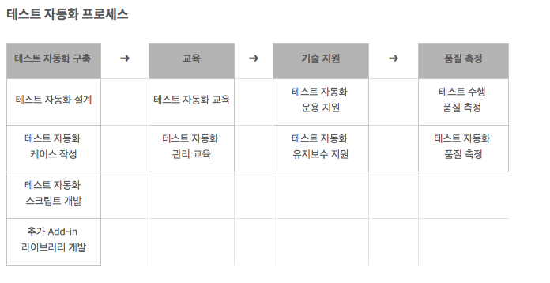

# Quest 19. Jest & Puppeteer

## Topics
* Automated Test
	* 테스트 자동화는 거의 모든 테스트 케이스를 대상으로 일관되고 빠르게 테스트할 수 있기 때문에 개발자의 부담을 줄이고 스프트웨어의 신뢰도를 높일 수 있다.
  * 일반적인 3가지 유형의 자동화 테스트: 단위 테스트, 통합 테스트, 인수 테스트
  * 안전성: 실제 운영/서비스에 기반한 자동화 방안 구축. 외부 요인을 차단한 테스트 계획 수립
  * 전문성: 전문화된 테스트 방법을 사용. 테스트 표준화를 통한 효율적인 방안 구축
  * 효율성: 효율적인 테스트 자동화 운영 방안 구축. 유지보수시에도 동일한 테스트 방안 적용
  * 비용 절감: 개발자의 단순 노동 감소. 오픈 소스 자동화 도구를 이용한 비용 절감.
  * 자동화 테스트 스크립트를 작성하는 것은 개발만큼 복잡하기도 하고 어렵기도 하기때문에 테스트 자동화 작업을 진행하다가 중단하기도 하고, 완료해도 오랫동안 유지 못하는 경우가 있음. 따라서 체계적인 접근이 필요하다. 
  * 테스트 자동화 프로세스
    
  (출처:http://junho0811.tistory.com/18)
* TDD
  * TDD(Test-Driven Development)란 개발 하기 전에 테스트 코드를 먼저 작성하는 것을 말한다. 따라서 정확한 프로그래밍 목적을 디자인 단계에서 반드시 미리 정의해야만 하고 또 무엇을 테스트해야 할 지 미리 정의해야만 한다.
  * 장점: 높은 퀄리티의 소프트웨어를 보장한다. 
    1. 보다 튼튼한 객체지향적인 코드 생산 가능: TDD는 코드의 재사용성을 보장해야만 가능하다.
    2. 재설계 시간의 단축: 테스트 코드를 먼저 작성하기 때문에 지금 무엇을 해야 하는지 분명히 정의하고 시작한다. 
    3. 디버깅 시간의 단축: 통합 테스트가 아닌 유닛테스트를 하는 이점. 각 모듈별로 테스트를 진행하므로 하나의 모듈을 테스트하기 위해서 전체 레이어를 테스트할 필요가 없어진다.
    4. 애자일과의 시너지 효과: 행위 동작 중심적인 방법으로 개발을 진행하는 방법론에 있어서 TDD를 진행하면 항상 그 테스트 요소들이 사용자 관점으로 정의되고 진행되기 때문에 보다 튼튼한 개발 프로세스를 만들게 된다.
    5. 테스트 문서의 대체가능: 어떤 요소들이 테스트 되었는지 테스트 정의서를 만들게 되는데 이 때 정의되는 것을 통합테스트 문서이다. 하지만 이럴 경우 세세한 요소가 어떻게 테스트 되었는지 제공할 수 없다. 하지만 TDD를 사용하면 테스팅을 자동화 시킴과 동시에 보다 정확한 테스트 근거를 산출할 수 있다.
    6. 추가 구현의 용이함: 개발 뒤에 새로운 기능을 추가할 때 다른 코드에 얼마나 영향을 미칠지 모르기 때문에 다시 모든 코드를 테스트 하는것에 있어서 곤욕이 생긴다. 하지만 유닛테스트를 진행할 경우 이러한 어려움을 해소할 수 있다.
  * 단점
    1. 코드 퀄리티보다는 빠른 결과물을 원하는 환경이라면 쉽게 도입이 어려울 수 있다. 왜냐하면 개발자들이 TDD를 공부해야 하고 추가적으로 테스트 코드를 작성해야 하기 때문이다. 익숙해지기 위한 시간이 필요하다.
    2. 어떻게 테스트를 할 것이며, 프로젝트 성격에 따른 테스트 프레임워크 선택 등 여러 부분에 대한 고려가 필요하다.
  * 출처: http://www.hoons.net/Lecture/View/644, https://m.blog.naver.com/PostView.nhn?blogId=suresofttech&logNo=221039173819&proxyReferer=https%3A%2F%2Fwww.google.co.kr%2F
* Unit Test
  * 일반적으로 모듈이나 객체를 구성하는 단일 함수 정도의 크기에 해당하는 코드 단위에 집중한다. 단일 함수에 대한 구체적인 테스트는 테스트 자체를 단순화하고 빠르게 작성하여 수행해 볼 수 있다는 장점을 갖는다. 이를 통해 많은 수의 단위 테스트들을 빠르게 만들 수 있고 보다 많은 버그를 바견하여 잡아 낼 수 있다. 구현된 코드에 대한 단위 테스트들을 갖고 있다면 변경과 상관없는 구현코드들이 이상없이 동작할 수 있다는 신뢰를 갖고 마음 편하게 코드를 수정할 수 있다.
  * 단위 테스트는 네트워크 접근이나 DB접근과 같은 의존성으로 부터 격리되어야 한다. 따라서 실제 기능 구동을 위해 필요로 하는 많은 사전 세팅 작업없이 모든 시나리오에 대한 테스트를 수행해 볼 수 있다.
  * 단위 테스트의 기본 조각들은 각각 하나의 행동에 대해서만 테스트 수행하고, 서로에 대해 독립적이어야 한다.
  * 출처: https://medium.com/@sryu99/%EB%8B%A8%EC%9C%84-%ED%85%8C%EC%8A%A4%ED%8A%B8-tdd-bdd%EC%9D%98-%EC%B0%A8%EC%9D%B4%EC%A0%90-3d25fab5ccb2
* Integration Test
  * 단위 테스트가 끝난 모듈을 통합하는 과정에서 발생할 수 있는 오류를 찾는 테스트이다. 실제 업무에서는 단위 모듈이 개별적으로 존재하는 것이 아니고 여러 모듈이 유기적 관계를 맺고 있으므로 이러한 모듈들을 결합한 형태로 테스트를 수행해봐야 한다. 이때 주로 확인하는 것은 '모듈 간의 상호작용이 정상적으로 수행되는가'이다. 모듈들이 모두 올바르게 연계되어 동작하는지 확인하는 것이다.
  * 빅뱅 테스트: 모듈 통합을 한꺼번에 하는 방법이다. 단위 테스트가 끝난 모듈을 한꺼번에 결합하여 수행하는 방식이다. 소규모 프로그램이나 프로그램의 일부를 대상으로 하는 경우가 많고 절차가 간단하고 쉽다. 하지만 에러가 발생했을 때 어떤 모듈에서 에러가 존재하고 그 원인이 무엇인지 찾기가 매우 어렵다.
  * 점진적으로 통합을 하는 방법도 있다. 완성된 모듈을 기존에 테스트된 모듈과 하나씩 통합하면서 테스트한다. 오류가 발생하면 직전에 새롭게 통합한 모듈에서 에러가 난 것이므로 에러를 발견하기가 쉽다. 점진적 통합 방식은 하향식 기법과 상향식 기법이 있다.
    1. 하향식 - 시스템을 구성하는 무듈의 계층 구조에서 맨 상위의 모듈부터 시작하여 점차 하위 모듈 방향으로 통합하는 방법이다. 상위 모듈을 전체 프로그램의 흐름을 관장하고 하위 모듈을 각 기능들을 담당하므로 프로그램 전체에 영향을 줄 수 있는 오류를 일찍 발견하기 쉽다. 하지만 하위 모듈은 임시 스텁들로 대체되어 있기 때문에 결과가 완전하지 않을 수도 있다. 따라서 모듈 간의 인터페이스와 시스템의 동작이 정상적으로 잘되고 있는지를 빨리 파악하고자 할 때 하향식 기법을 사용하는 것이 좋다.
    1. 상향식 기법: 상위 모듈의 역할을 하는 테스트 드라이버가 필요하다. 이 드라이버는 하위 모듈을 순서에 맞게 호출하고, 호출할 때 필요한 매개 변수를 제공하며, 반환 값을 전달하는 역할을 한다. 장점은 최하위 모듈들을 개별적으로 병행하여 테스트할 수 있기 때문에 하위에 있는 모듈들을 충분히 테스트할 수 있다. 정밀한 계산이나 데이터 처리가 요구되는 시스템 같은 경우에 사용하면 좋다. 그러나 상위 모듈에 오류가 발견되면 그 모듈과 관련된 하위 모듈을 다시 테스트해야 하는 번거로움이 생길 수 있다.
* E2E Test
  * end to end testing의 줄임말. 현장에서 실제로 수행되는 것처럼 데이터베이스, 네트워크 하드웨어, 시스템등을 이용하여, 시스템의 기능을 처음부터 끝까지 테스트한다. 시스템 테스트에 속한다. 시나리오, 기능, 통합, GUI 테스트를 하는데 사용한다. API와의 연동도 테스트 항목에 포함되기 때문에 일반적으로 mock, stub과 같은 것들이 필요하지 않다. 따라서 테스트 속도가 서비스 규모에 따라 상당히 느릴 수 있다. 그렇기에 유닛 테스트나 기능 테스트를 위한 일반적인 테스트 자동화와 시스템 테스트를 위한 E2E 테스트 자동화를 함께 구성한다.
* Stub & Mock
  * 엄밀히 구분하면 조금씩 다르지만 테스트 대상을 의존하는 것으로부터 격리 시킬 때 실제가 아닌 다른 것으로 대체 하는데 이때 사용하는 것들이다.
  * Stub: 로직이 없고 단지 원하는 값을 반환한다. 테스트시에 '이 객체는 무조건 이 값을 반환한다'고 가정할 경우 사용할 수 있다. 상태 검증에 사용된다.
  * Mock: '어떤 메소드가 호출 될 것이다'라는 행위에 대한 예상을 가지고 있다. 이렇듯 만약 예상대로 메소드가 호출 되지 않을 경우 테스트는 실패한다. 객체 사이의 행위를 테스트하기 위해 사용한다. 식별 할 수 있는 상태 변경이 없거나 반환 값으로 확인 할 수 없는 경우에 유용하다. ex) 어떤 코드가 디스크에서 read작업을 하는데 하나 이상의 디스크에서 read 작업을 수행하지 않도록 하려는 경우, read 작업을 수행하는 메소드가 한번만 호출 되었는지 검증하기 위해 Mock을 사용할 수 있다.
  * 출처:http://www.jpstory.net/2013/07/26/know-your-test-doubles/
* Jest
  * 페이스북에서 만든 테스트 프레임워크
  * ~~.test.js로 형식으로 파일명을 만들어야 한다.
  * 비동기 처리
    * 비동기를 테스트 하기 위해서는 
    ```
    test('the data is peanut butter', done => {
      function callback(data) {
        expect(data).toBe('peanut butter');
        done();
      }
      fetchData(callback);
    });
    ```
    의 형식으로 작성해야 한다. 이 때 `done()`이 호출되지 않다면 테스트는 실패한다.
  * 테스트 전과 후 처리는 `beforeAll`, `beforeEach`, `afterAll`, `afterEach`로 할 수 있다. 이 때 All이 붙은 함수들은 한 파일에서 한 번만 실행되고 Each가 붙은 함수들은 각 테스트마다 실행된다. 만약 특정 테스트에만 테스트 전후 처리를 하기 위해서는 `describe`에 넣으면 된다.
  * 테스트 순서는 각 describe의 것들이 모두 실행된 후 내부 describe에 있는 test들과 현재 감싸고 있는 describe안에 있는 test들이 순서대로 실행된다.
* Puppeteer

## Checklist
* 자동화된 테스트를 만드는 것에는 어떤 장점과 단점이 있을까요?
  * TDD(Test-Driven Development)란 무엇인가요? TDD의 장점과 단점은 무엇일까요?
* 테스트들 간의 계층에 따라 어떤 단계들이 있을까요?
  * 유닛 테스트, 통합 테스트, E2E 테스트는 각각 어떤 것을 뜻하나요?
  * 테스트에 있어서 Stub과 Mock은 어떤 개념을 가리키는 것일까요?
* Jest는 어떤 일을 하며 어떻게 사용하는 테스트 프레임워크일까요?
  * Jest 이외의 테스트 프레임워크는 어떤 것이 있고 어떤 장단점이 있을까요?
* Puppeteer는 어떤 일을 하며 어떻게 사용하는 테스트 프레임워크일까요?
